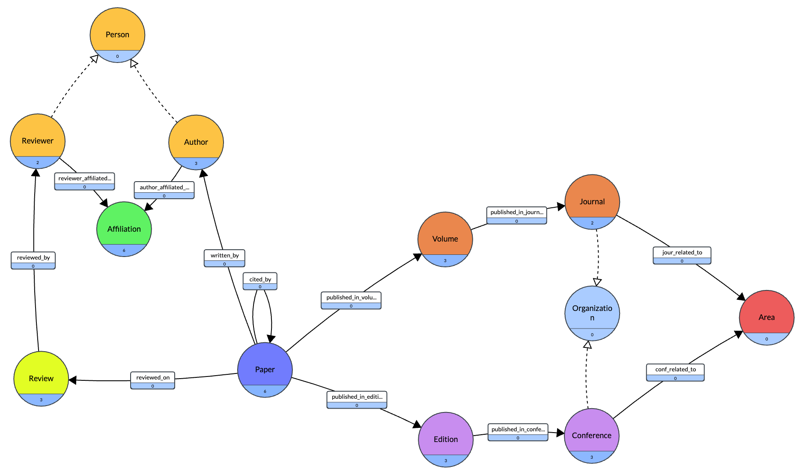

# Introduction

In this project, we explore the construction and utilization of
knowledge graphs using GraphDB and the RDFS language. We’ll outline the
steps involved in setting up and querying these graphs, and discuss the
results achieved.

<br>
This project was built as part of a course at UPC.

<div align="center">
    
</div>

# Ontology Creation

## TBOX definition

Firstly, we used the knowledge graph visualization tool Gra.fo to create
the TBOX which is represented in Figure
<a href="SDM-Lab2-TBOX_png.png" data-reference-type="ref"
data-reference="fig:tbox_img">1</a>. You can find and look further in
our graph through this
[link](https://app.gra.fo/editor/9772ce47-e4d5-4ea2-b924-851ec84f56e7/public?token=ecbd6716995e59bbd23d37c6dcc6045f382199fc2a5533eff7ce62cc345eea84).
Even if there is no such thing as attributes in knowledge graphs, Gra.fo
uses the term "attributes" to refer "Resource to Literal" triples that
define the characteristics of the resource; in the same manner we might
use this definition of the word "attributes" while explaining our TBOX
definition, below. Moreover, you can find our exported Turtle file from
Gra.fo in our submission, named as
"_BDMA11-E-B1-CoessensIslek-TBOX.ttl_".

**Decisions and Assumptions:**

- We decided to create a **Person** superclass which has **Author**
  and **Reviewer** under it to have a neat representation.

- We assumed that all reviewers are persons who review and author and
  authors are the people who only author but do not review.

- We decided to create another superclass, **Organization** and added
  **Journal** and **Conference** as subclasses, then we assumed that
  both of them could be related to the same generated fields.

- We decided to generate some related research areas which are
  **"Databases"**, **"Machine Learning"**, **"Network Security"**, and
  **"Artificial Intelligence"**, and randomly assigned them to
  organizations since in our dataset did not have research area
  information for journals/conferences.

<figure id="fig:tbox_img">

<figcaption>TBOX graphical representation</figcaption>
</figure>

## ABOX definition

For defining the ABOX, we employed RDFLib, a powerful Python library
designed to work with RDF data. The framework facilitated the creation
and manipulation of triples from non-semantic sources, allowing us to
construct a structured semantic representation of our data. The script
named as "_BDMA11-E-B2-CoessensIslek.py_", provided in the supplementary
zip file, outlines the steps taken to transform, serialize, and prepare
the data for integration with our knowledge graph.  
The ABOX was constructed using the following CSV files from previous
laboratory exercises: Figure
<a href="#tab:csv_data_sources" data-reference-type="ref"
data-reference="tab:csv_data_sources">1</a>. You can our ABOX file in
the same folder named as "_BDMA11-E-B2-CoessensIslek-ABOX.ttl_".

| **Data**            | **File Path**                                |
| :------------------ | :------------------------------------------- |
| Authors             | `data-from-lab1/authors.csv`                 |
| Papers Details      | `data-from-lab1/papers_details_enriched.csv` |
| Affiliations        | `data-from-lab1/affiliations.csv`            |
| Author Affiliations | `data-from-lab1/affiliated_with.csv`         |
| Citations           | `data-from-lab1/citations.csv`               |
| Written By          | `data-from-lab1/written_by_enriched.csv`     |
| Conferences         | `data-from-lab1/conferences_enriched.csv`    |
| Journals            | `data-from-lab1/journals_enriched.csv`       |
| Published In        | `data-from-lab1/published_in.csv`            |
| Reviews             | `data-from-lab1/reviews.csv`                 |
| Reviewed By         | `data-from-lab1/reviewed_by.csv`             |
| Review On           | `data-from-lab1/review_on.csv`               |

CSV Data Sources for ABOX Construction

We will explain our approach taken by giving some examples of functions
used to construct the ABOX file. We first load the TBOX definition from
a Turtle (.ttl) file into an RDF graph. The graph is initialized using
the Graph() constructor from the RDFLib library, and the TBOX is parsed
to incorporate its structure into the graph.  
We describe our methodology for structuring the data using two example
functions: the first creates nodes within the graph, while the second
establishes relationships between these nodes.

- `add_affiliation_to_graph` – This function adds each of the
  affiliations to the graph. These are the Universities and Companies.

- `add_author_to_graph` – This function adds each of the authors to
  the graph.

- `link_author_to_affiliation` – This function links each author in
  the graph to an affiliation.

- `add_paper_to_graph` – This function adds each of the papers to the
  graph.

- `add_citation_to_graph` – This function adds each of the citations
  to the graph.

- `link_paper_author` – This function links each paper in the graph to
  an author.

- `add_research_areas_to_graph` – This function adds each of the
  research areas to the graph.

- `add_conference_to_graph` – This function adds each of the
  conferences to the graph.

- `add_conference_edition_to_graph` – This function adds each of the
  conference editions to the graph.

- `add_journal_to_graph` – This function adds each of the journals to
  the graph.

- `add_journal_volume_to_graph` – This function adds each of the
  journal volumes to the graph.

- `add_review_to_graph` – This function adds each of the reviews to
  the graph.

- `link_review_to_paper` – This function adds links each of the
  reviews to the papers in the graph.

- `link_review_to_author` – This function adds links from each of the
  reviews to the authors in the graph.

- `link_paper_to_venue` – This function adds links from each of the
  papers to venues that are either Conferences Editions or Journal
  Volumes

Here we give an example of the syntax used for these functions:

```python
[h]
def add_citation_to_graph(graph, paper_id, reference_id, year):
    paper_uri = EX[f'Paper/{paper_id}']
    reference_uri = EX[f'Paper/{reference_id}']
    graph.add((paper_uri, EX.cited_by, reference_uri))
    graph.add((paper_uri, EX.citation_year, Literal(year, datatype='http://www.w3.org/2001/XMLSchema#integer')))
```

```python
[h]
def link_paper_author(graph, paper_id, author_id):
    paper_uri = EX[f'Paper/{paper_id}']
    author_uri = EX[f'Author/{author_id}']
    graph.add((paper_uri, EX.written_by, author_uri))
```

Finally, we exported the created graph into a Turtle file.

## Loading TBOX and ABOX

We then loaded our TBOX and ABOX files into GraphDB. Because the links
were created using RDFLib in our code, we did not have to link them
after loading.  
The base URI used to import is `http://www.gra.fo/schema/untitled-ekg#`.

# Querying the Database

**Assumptions we made:**

- As we also mentioned before, it is assumed that all reviewers are
  also authors that exist in our database but authors are the people
  who only authored but did not review. These two classes, **Author**
  and **Reviewer** are under a superclass **Person**.

- Since in our dataset we did not have research area information for
  journals/conferences we created the following research areas:
  **"Databases"**, **"Machine Learning"**, **"Network Security"**, and
  **"Artificial Intelligence"**, and randomly assigned them to
  organizations.

We will now list our queries and give part of the related results.

```sql
PREFIX rdf: <http://www.w3.org/1999/02/22-rdf-syntax-ns#>
PREFIX : <http://www.gra.fo/schema/untitled-ekg#>

SELECT DISTINCT ?author
WHERE {
  ?author rdf:type :Author .
}
```

| **No.** | **Author URI**        |
| :-----: | :-------------------- |
|    1    | `ex:Author/1686360`   |
|    2    | `ex:Author/13288046`  |
|    3    | `ex:Author/145298798` |

Part of Results Query to Select Authors

```sql
PREFIX rdfs: <http://www.w3.org/2000/01/rdf-schema#>
PREFIX : <http://www.gra.fo/schema/untitled-ekg#>

SELECT DISTINCT ?property
WHERE {
  ?property rdfs:domain :Author .
}
```

| **No.** | **Author Detail** |
| :-----: | :---------------- |
|    1    | `ex:author_email` |
|    2    | `ex:author_name`  |

Details of Author Information

```sql
PREFIX rdfs: <http://www.w3.org/2000/01/rdf-schema#>
PREFIX : <http://www.gra.fo/schema/untitled-ekg#>

SELECT DISTINCT ?property
WHERE {
  {
    ?property rdfs:domain :Conference .
  } UNION {
    ?property rdfs:domain :Journal .
  }
}
```

| **No.** | **Conference Detail** |
| :-----: | :-------------------- |
|    1    | `ex:conf_city`        |
|    2    | `ex:conf_edition`     |
|    3    | `ex:conf_name`        |
|    4    | `ex:conf_ss_venue_id` |
|    5    | `ex:conf_type`        |

Part of Results Query Properties Related to Conferences and Journals

```sql
PREFIX gf: <http://www.gra.fo/schema/untitled-ekg#>
PREFIX rdf: <http://www.w3.org/1999/02/22-rdf-syntax-ns#>
PREFIX rdfs: <http://www.w3.org/2000/01/rdf-schema#>
PREFIX ex: <http://www.gra.fo/schema/untitled-ekg#>

SELECT DISTINCT ?PaperTitle ?Area
WHERE {
  ?Author rdf:type gf:Author .
  ?Author gf:author_name "C. Chung" .
  ?Paper gf:written_by ?Author .
  ?Paper gf:published_in_edition ?Edition .
  ?Edition gf:published_in_conference ?Conference .
  ?Conference gf:conf_related_to ?Area .
  ?Area gf:Area "Databases" .
  ?Paper gf:paper_title ?PaperTitle .
}
```

| **No.** | **Publication Detail**                          |
| :-----: | :---------------------------------------------- |
|    1    | `"An Indexing and Retrieval Mechanism for ..."` |
|         | `ex:Area/Databases`                             |

Details of a Specific Publication

Below you can find the two additional SPARQL queries that we thought
would be interesting and useful to analyze.

This first query identifies the top-cited papers within a specific
research area, providing insights into influential works and trends in
that field.

```sql
PREFIX ex: <http://www.gra.fo/schema/untitled-ekg#>

SELECT ?paperTitle (COUNT(?citation) AS ?numberOfCitations) WHERE {
  ?area ex:Area "Machine Learning" .
  ?conference ex:conf_related_to ?area .
  ?edition ex:published_in_conference ?conference .
  ?paper ex:published_in_edition ?edition .

  ?citation ex:cited_by ?paper .
  ?paper ex:paper_title ?paperTitle .
}
GROUP BY ?paperTitle
ORDER BY DESC(?numberOfCitations)
LIMIT 10
```

| **No.** | **Paper Title**                                       | **Citations** |
| :-----: | :---------------------------------------------------- | :------------ |
|    1    | "Game creativity analysis using neural networks"      | 19            |
|    2    | "An Indexing and Retrieval Mechanism for Complex ..." | 16            |
|    3    | "Integrating Locking and Optimistic Concurrency ..."  | 14            |
|    4    | "A UIMA Database Interface for Managing ..."          | 13            |

Overview of papers and their citation counts

Below, this query aggregates citation counts for papers grouped by their
associated research areas, providing a view of which areas are most
influential based on scholarly citations.

```sql
PREFIX ex: <http://www.gra.fo/schema/untitled-ekg#>

SELECT ?researchArea (COUNT(?citation) AS ?totalCitations) WHERE {
  ?conference ex:conf_related_to ?area .
  ?area ex:Area ?researchArea .

  ?edition ex:published_in_conference ?conference .
  ?paper ex:published_in_edition ?edition .

  OPTIONAL {
    ?citation ex:cited_by ?paper .
  }
}
GROUP BY ?researchArea
ORDER BY DESC(?totalCitations)
```

| **No.** | **Research Area**       | **Total Citations** |
| :-----: | :---------------------- | :------------------ |
|    1    | Network Security        | 722                 |
|    2    | Databases               | 665                 |
|    3    | Artificial Intelligence | 655                 |
|    4    | Machine Learning        | 563                 |

Total citations received for different research areas
